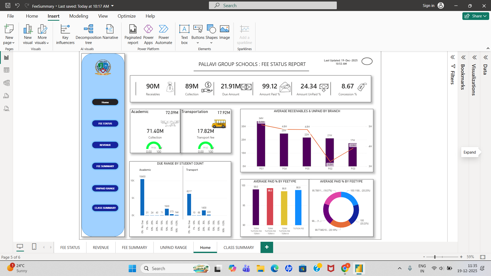

# School Fee Analytics Dashboard

## Overview
This project is a Power BI dashboard built to analyze school fee data including receivables, collections, and unpaid amounts.

## Dashboard Preview

## Business Problem
Schools need better visibility into fee collection, unpaid dues, and branch performance to improve financial tracking.

## Dataset
Sample school fee dataset including student fees, payment status, and branch details.

## Key Features
- KPI tracking (Receivables, Collection, Due Amount)
- Branch-wise performance analysis
- Paid vs Unpaid percentage
- Fee type insights (Academic & Transport)

## Tools Used
- Power BI
- Excel

## Insights
- Identified branches with high unpaid fees
- Improved visibility of financial data
- Helped in better decision-making

## Files
- School-Fee-Dashboard.pbix
